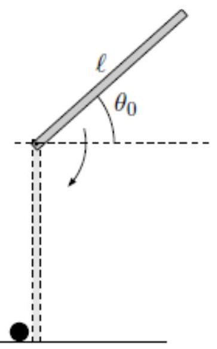
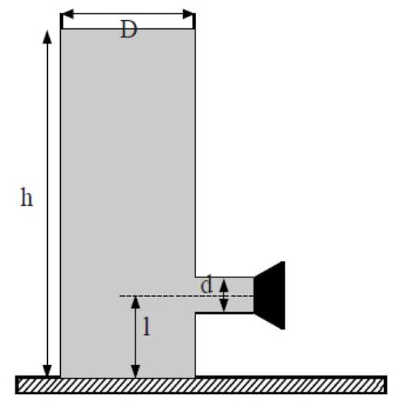

>Università di Catania  
Corso di Laurea in Fisica  
Compito scritto di Fisica Generale I  
M.G. Grimaldi - A. Insolia 
Catania, 22 Giugno 2022

>Per la prova in itinere ( 2 ore) svolgere i problemi: $3,4,5$ 
Per la prova completa ( 3 ore) svolgere i problemi: $1,2,3,4$

---

## Esercizio 1

Un corpo (puntiforme) di massa $m=3.00 \mathrm{~kg}$ viene lanciato
orizzontalmente con una velocità $v_{0}$, diretta come in figura, su di
un piano privo di attrito. Come si vede dalla figura, procedendo verso
destra il corpo raggiunge una lastra (inizialmente in quiete) anch'essa
libera di muoversi senza attrito. La lastra ha lunghezza
$\mathrm{l}=2.00 \mathrm{~m}$ e massa $M=20.0 \mathrm{~kg}$. Quando il
corpo scivola sulla lastra risente di un attrito dinamico con
$\mu_{\mathrm{k}}=0.500$. Sapendo che dopo esservi salito il corpo
raggiunge il centro della lastra (rimanendo in quiete rispetto ad essa),
determinare:

a\) il valore di $v_{0}$;

b\) la velocità finale del sistema lastra+corpo;

c\) l'energia dissipata nell'intero processo.

.jpg)

??? success "Visualizza le soluzioni"
    - $v_{0} = 3.36 \mathrm{~m} / \mathrm{s}$;

    - $0.44 \mathrm{~m} / \mathrm{s}$;

    - $14.7 \mathrm{~J}$.

??? note "Visualizza lo svolgimento"
    

## Esercizio 2

Come schematizzato in figura, si abbia una sbarra rigida sottile, di
lunghezza $\mathrm{I}=2.00 \mathrm{~m}$ e massa $\mathrm{m}$, disposta
in un piano verticale. La sbarra può ruotare liberamente intorno ad un
perno orizzontale passante per un suo estremo. La sbarra viene liberata
(da ferma) quando forma un angolo iniziale $\theta_{0}$ con
l'orizzontale (vedi figura); quando la sbarra raggiunge la verticale il
suo estremo inferiore urta elasticamente un corpo di massa
$\mathrm{m} / 2$ posto in quiete in quella posizione. Trascurando ogni
forma di attrito e sapendo che dopo l'urto il corpo puntiforme parte
verso sinistra con una velocità
$\mathrm{v}_{\mathrm{f}}=6.00 \mathrm{~m} / \mathrm{s}$, determinare:

a\) I'angolo $\theta_{0}$ da cui è stata lasciata andare la sbarra;

b\) l'angolo massimo (dalla verticale) che raggiunge la sbarra dopo l'urto. 

??? success "Visualizza le soluzioni"
    - $\theta_{0} = -2.54^{\circ}$;

    - $15.9^{\circ}$;

??? note "Visualizza lo svolgimento"
    

## Esercizio 3

Un recipiente è costituito da un cilindro verticale di diametro
$D=9.0 \mathrm{~cm}$ sul quale è innestato un tubo orizzontale di
diametro $\mathrm{d}=3.0 \mathrm{~cm}$ ad una distanza
$\mathrm{I}=5 \mathrm{~cm}$ dal fondo del cilindro. All' altro estremo
del tubo orizzontale viene messo un tappo (vedi figura) ed il recipiente
viene riempito di acqua fino all' altezza $h=50 \mathrm{~cm}$.

a\) Si determini la velocità di uscita dell'acqua quando viene rimosso il tappo. Si noti che d non è trascurabile rispetto a D. 

b\) A che distanza dal tubo l'acqua in uscita tocca il piano?

??? success "Visualizza le soluzioni"
    - $2.98 \mathrm{~m} / \mathrm{s}$;

    - $0.3 \mathrm{~m}$;

??? note "Visualizza lo svolgimento"
    

## Esercizio 4

Un quantità $\mathrm{n}=1.50$ mol di un gas ideale biatomico segue il
ciclo reversibile schematizzato in figura costituito dalle seguenti
trasformazioni: $1 \rightarrow 2$ isobara; $2 \rightarrow 3$ isocora;
$3 \rightarrow 1$ trasformazione corrispondente al segmento rettilineo
che unisce gli stati 3 e 1. Pressione e temperatura dello stato 1 sono
$p_{1}=3.00$ atm e $T_{1}=200 \mathrm{~K}$; per i volumi e le pressioni
degli altri stati è $\mathrm{V}_{2}=\mathrm{V}_{3}=2 \mathrm{~V}_{1}$ e
$\mathrm{p}_{3}=$ $\mathrm{p}_{1} / 3$.

Determinare:

a\) il volume occupato dal gas nello stato 1 e le sue temperature negli stati 2 e 3; 

b\) il lavoro compiuto dal gas nell'intero ciclo; 

c\) la variazione di entropia subita dallo stesso nella trasformazione $3 \rightarrow 1$.

.jpg)

??? success "Visualizza le soluzioni"
    - $8.21 \left.\mathrm{dm}^{3}, 400 \mathrm{~K}, 133 \mathrm{~K}\right.$

    - $831 \mathrm{~J}$

    - $4.00 \mathrm{~J} / \mathrm{K}$

??? note "Visualizza lo svolgimento"
    

## Esercizio 5

Un pezzetto di ghiaccio di massa $\mathrm{m}$ e alla temperatura di
$T_{1}=250 \mathrm{~K}$ viene immerso in $\mathrm{m}_{2}=60 \mathrm{~g}$
di acqua a temperatura di $T_{2}=330 \mathrm{~K}$. Se il sistema è
contenuto in un recipiente a pareti adiabatiche:

a\) si determini per quali valori della massa m il pezzetto di ghiaccio fonde completamente;

b) calcolare la temperatura di equilibrio del sistema se la massa del cubetto di ghiaccio vale $35 \mathrm{~g}$.

II calore specifico del ghiaccio vale
$\mathrm{c}_{\mathrm{g}}=2051 \mathrm{~J} / \mathrm{KgK}$, il calore
specifico dell'acqua vale $\mathrm{c}_{\mathrm{a}}=4186.8$
$\mathrm{J} / \mathrm{KgK}$ ed il calore latente di fusione del ghiaccio
è pari a $\lambda_{f}=3.3 \times 10^{5} \mathrm{~J} / \mathrm{Kg}$.

??? success "Visualizza le soluzioni"
    - $\leq 37.8 \mathrm{~g}$

    - $309.1 \mathrm{~K}$

??? note "Visualizza lo svolgimento"
    

---

[:fontawesome-regular-file-pdf: Download](pdf/2022-06-22.pdf){ .md-button }
