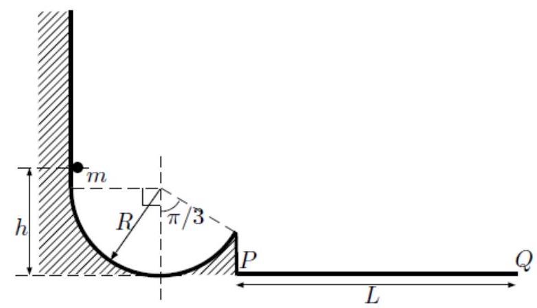
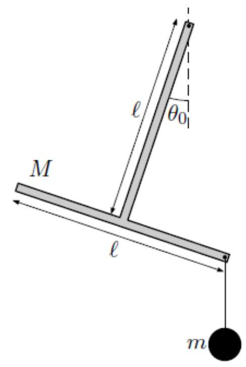

>Università di Catania 
Corso di Laurea in Fisica 
Compito scritto di Fisica Generale I 
M.G. Grimaldi - A. Insolia 
Catania, 13 Luglio 2022

>Per la prova in itinere ( 2 ore) svolgere i problemi: $3,4,5$ 
Per la prova completa (3 ore) svolgere i problemi: $1,2,3,4$

---

## Esercizio 1

Come mostrato in figura, una guida è costituita da un tratto verticale
rettilineo e da un arco di circonferenza di raggio
$\mathrm{R}=50.0 \mathrm{~cm}$; la parte destra dell'arco di
circonferenza ha un apertura (rispetto alla verticale) di $\pi / 3$.
Affiancata alla guida vi è un tratto rettilineo orizzontale di lunghezza
$\mathrm{L}=3 \mathrm{R}$ (dal punto $\mathrm{P}$ al punto $\mathrm{Q}$
) alla quota del punto più basso della guida. Un punto materiale di
massa m viene lasciato libero (in quiete) da un punto della guida ad una
quota iniziale $\mathrm{h}$ (misurata dal punto più basso della guida);
il corpo, dopo aver scivolato lungo la guida stessa, cadrà (dopo un
breve volo) sul tratto orizzontale. Trascurando ogni tipo di attrito
(sia con la guida che con l'aria), determinare:

a\) il valore di $h, h_{P}$, affinchè il punto materiale cada nel punto
$P$;

b\) il valore di $h, h_{Q}$, affinchè il punto materiale cada nel punto
$Q$;

c\) la massima quota raggiunta dal punto materiale durante il suo volo
nel caso di $h=R$.

??? success "Visualizza le soluzioni"
    

??? note "Visualizza lo svolgimento"
    

## Esercizio 2

Si abbia (come schematizzato in figura) un corpo rigido a forma di T
rovesciata di massa $\mathrm{M}=4 \mathrm{~m}$. La T rovesciata è
costituita da due barre sottili identiche di lunghezza I=100 cm e massa
$2 \mathrm{~m}$, con il centro della seconda saldata ad uno degli
estremi della prima. Come mostra la figura, l'altro estremo della prima
barra è imperniato ad una asse orizzontale intorno a cui la T può
ruotare liberamente; inoltre, dalla figura si vede che ad uno degli
estremi della seconda barra è appeso, tramite un filo di massa
trascurabile, un corpo di massa $m$.

a\) Pensando il sistema in equilibrio statico determinare l'angolo
$\theta_{0}$ (vedi figura) che la prima barra della T rovesciata forma
con la verticale.

b\) Supponendo poi che il filo che sostiene il corpo di massa $m$ venga
tagliato, si determini il periodo delle oscillazioni che la T rovesciata
inizierebbe a fare (data la piccola ampiezza di queste, si considerino
le oscillazioni come piccole).

??? success "Visualizza le soluzioni"
    

??? note "Visualizza lo svolgimento"
    

## Esercizio 3

Un cubo omogeneo di lato $10 \mathrm{~cm}$ e densità
$0.7 \mathrm{~g} / \mathrm{cm}^{3}$ viene posto (con velocità nulla) sul
fondo di un contenitore pieno d' acqua. L' altezza del liquido è un
metro.

a\) Calcolare la velocità con cui la faccia superiore del cubo raggiunge
il pelo libero superiore dell'acqua.

b\) Se il cubo fosse attaccato al fondo tramite una molla di lunghezza a
riposo nulla e $k=10 \mathrm{~N} / \mathrm{m}$, quale sarebbe
l'elongazione massima della molla?

??? success "Visualizza le soluzioni"
    

??? note "Visualizza lo svolgimento"
    

## Esercizio 4

Una mole di un gas perfetto monoatomico compie un ciclo termodinamico
reversibile. A partire dallo stato di equilibrio 1 con $p_{1}=1$ bar,
$T_{1}=300 \mathrm{~K}$, vengono eseguite le seguenti trasformazioni in
sequenza: espansione isobara fino allo stato 2 ed espansione adiabatica
fino allo stato 3, quindi compressione isoterma per riportare il gas
allo stato iniziale.

a\) Determinare il volume occupato dal gas negli stati 2 e 3 , se il
calore assorbito totale è pari a
$\mathrm{Q}_{\mathrm{a}}=2000 \mathrm{~J}$.

b\) Determinare il rendimento del ciclo.

??? success "Visualizza le soluzioni"
    

??? note "Visualizza lo svolgimento"
    

## Esercizio 5

Un calorimetro è composto da un recipiente contenente acqua, isolato
termicamente dall'ambiente esterno e riscaldato con un dispositivo che
fornisce un potenza $\mathrm{P}=45 \mathrm{~W}$. Il tempo necessario a
portare il sistema dalla temperatura ambiente
$T_{A}=20^{\circ} \mathrm{C}$ alla temperatura
$T_{B}=50{ }^{\circ} \mathrm{C}$ è pari a 20 minuti. Successivamente
viene posto nel recipiente un corpo di massa $m=100 \mathrm{~g}$ di un
materiale di calore specifico incognito, misurando il tempo di
riscaldamento da $T_{A}$ a $T_{B}$ si trova che ora esso é pari a
$1280 \mathrm{~s}$. Calcolare:

a\) il calore specifico incognito della sostanza che costituisce il
corpo;

b\) la variazione di energia interna del sistema (calorimetro+materiale)
e del materiale nel processo di riscaldamento;

c\) la variazione di entropia del materiale quando viene raffreddato da
$50{ }^{\circ} \mathrm{C}$ a $20^{\circ} \mathrm{C}$.

??? success "Visualizza le soluzioni"
    

??? note "Visualizza lo svolgimento"
    

---

[:fontawesome-regular-file-pdf: Download](pdf/2022-07-13.pdf){ .md-button }
