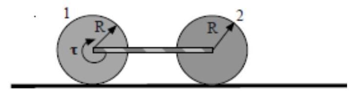

---
title: |
    Università di Catania Corso di Laurea in Fisica Compito scritto di
    Fisica Generale I M.G. Grimaldi - A. Insolia
---

Per la prova in itinere ( 2 ore) svolgere i problemi: $3,4,5$

Catania, 7 Settembre 2022

Per la prova completa (3 ore) svolgere i problemi: $1,2,3,4$

Problema n.1
============

Un corpo viene lanciato verso l'alto. Raggiunto il punto di quota
massima $h$ all'istante $t=0$, esso si divide in tre parti di massa
uguale. Uno dei tre frammenti, di velocità iniziale $\mathrm{v}_{1}$
diretta verticalmente (vedi figura) raggiunge il suolo all'istante
$t_{1}=4 \mathrm{~s}$, gli altri due atterrano insieme all'istante
$t_{2}=5 \mathrm{~s}$. Determinare:

a\) la quota massima $h$ raggiunta dal corpo prima dell'esplosione;

b\) le componenti lungo y delle velocità dei tre frammenti al momento
dell'esplosione.

)

Problema n.2
============

Gli assi di due cilindri pieni, aventi lo stesso raggio
$\mathrm{R}=20 \mathrm{~cm}$ e masse
$\mathrm{m}_{1}=20 \mathrm{~kg} \mathrm{e} \mathrm{m}_{2}=30 \mathrm{~kg}$,
sono collegati da una sbarra rigida di massa trascurabile (vedi figura).
Ciascun cilindro può ruotare liberamente attorno al proprio asse. All'
asse del cilindro 1 è applicato un momento di modulo $\mathrm{M}$ ed il
pavimento su cui sono appoggiati i cilindri presenta un coefficiente di
attrito statico $\mu_{s}=0.50$. Determinare:

a\) la massima accelerazione (dei centri di massa), $a_{\max }$ con cui i
due cilindri avanzano di puro rotolamento;

b\) il valore di $M, M_{\max }$, che deve agire sul cilindro 1 nella
situazione del punto a).

\[Si noti che, a causa dell'asta che connette i due cilindri, questi
hanno la stessa accelerazione angolare\]

Problema n.3
============

Un corpo di volume $V$ e avente densità
$\rho_{c}=0.800 \mathrm{~g} / \mathrm{cm}^{3}$, partendo dalla quiete e
dopo aver percorso in caduta libera in aria una distanza
$h_{A}=1.00 \mathrm{~m}$, entra in una vasca contenente acqua.
Trascurando la viscosità, calcolare la massima profondità $h_{B}$
(rispetto alla superficie libera dell'acqua) raggiunta dal corpo.

Problema n.4
============

Una mole di gas ideale monoatomico, partendo dallo stato A
caratterizzato da $V_{A}=8 \mathrm{dm}^{3}$ e $T_{2}=500$ $\mathrm{K}$,
compie un ciclo termodinamico reversibile costituito, nell'ordine, da:
una trasformazione isoterma fino allo stato $B$ con
$\mathrm{V}_{\mathrm{B}}=2 \mathrm{~V}_{\mathrm{A}}$, una espansione
adiabatica fino allo stato $C$ caratterizzato da
$T_{0}=260 \mathrm{~K}$, una trasformazione isoterma fino allo stato $D$
con $\mathrm{V}_{\mathrm{D}}=6 \mathrm{~V}_{\mathrm{B}}$, una
compressione adiabatica fino allo stato $E$ con $T_{1}=360 \mathrm{~K}$,
una compressione isoterma fino allo stato $F$ e quindi una compressione
adiabatica che riporta il sistema alla condizione iniziale $A$.

a\) Scelto un valore arbitrario di riferimento per l'entropia del sistema
in A, disegnare il ciclo termodinamico su un diagramma S-T (con S
entropia del sistema).

b\) Calcolare il calore totale scambiato nel ciclo.

c\) Determinare il rendimento del ciclo.

Problema n.5
============

Un pezzetto di ghiaccio di massa $m$ e alla temperatura di
$\mathrm{T}_{1}=250 \mathrm{~K}$ viene immerso in $m_{2}=60 \mathrm{~g}$
di acqua a temperatura di $\mathrm{T}_{2}=330 \mathrm{~K}$. Se il
sistema e contenuto in un recipiente a pareti adiabatiche:

a\) si determini per quali valori della massa $m$ il pezzetto di ghiaccio
fonde completamente;

b\) calcolare la temperatura di equilibrio del sistema se la massa del
cubetto di ghiaccio vale $\quad$ g. II calore specifico del ghiaccio
vale $\mathrm{c}_{\mathrm{g}}=2051 \mathrm{~J} / \mathrm{KgK}$, il
calore specifico dell'acqua vale
$\mathrm{c}_{\mathrm{a}}=4186.8 \mathrm{~J} / \mathrm{KgK}$ ed il calore
latente di fusione del ghiaccio e pari a
$\lambda_{f}=3.3 \times 10^{5} \mathrm{~J} / \mathrm{Kg}$.

??? success "Visualizza le soluzioni"
    

??? note "Visualizza lo svolgimento"
    

---

[:fontawesome-regular-file-pdf: Download](pdf/2022-09-07.pdf){ .md-button }
