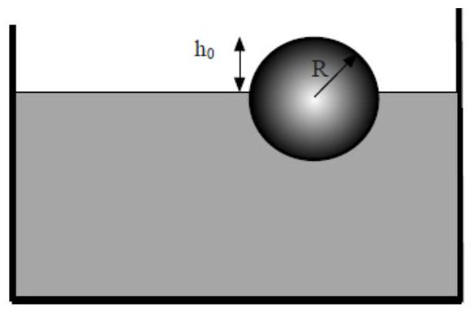

>Università di Catania 
Corso di Laurea in Fisica 
Compito scritto di Fisica Generale I 
M.G. Grimaldi - A. Insolia 
Catania, 22 Settembre 2022

???+ info
    Per la prova in itinere ( 2 ore) svolgere i problemi: $3,4,5$ 
    Per la prova completa (3 ore) svolgere i problemi: $1,2,3,4$

---

## Esercizio 1

Un corpo puntiforme di massa $m=120 \mathrm{~g}$ è a riposo su un piano
orizzontale liscio. Dall'istante $\mathrm{t}=0$ viene sollecitato da una
forza di modulo $F=F_{0}\left[1-e^{-t / \tau}\right]$ con
$F_{0}=27 \mathrm{~N}$ e $\tau=8 \mathrm{~s}$ e che forma un angolo
$\alpha=35^{\circ}$ con il piano. Determinare:

a\) I'stante $t^{*}$ in cui il corpo abbandona il piano;

b\) il lavoro compiuto dalla forza nell'intervallo
$\left[0, t^{*}\right]$.

??? success "Visualizza le soluzioni"
    

??? note "Visualizza lo svolgimento"
    

## Esercizio 2

Si consideri una guida sferica di raggio $\mathrm{R}$ e centro $O$,
posizionata in un piano verticale, sulla quale rotola senza strisciare
una palla (sferica) di raggio $r$ e massa $m$ (si veda la figura). La
palla è inizialmente ferma sulla sommità della guida e, a seguito di una
piccola perturbazione, comincia a muoversi verso destra. Sia $\theta$
l'angolo formato dalla retta che unisce $O$ con il centro di massa $G$
della palla, e la direzione verticale (come in figura). Quanto vale
$\theta$ quando la palla si stacca dalla guida?

??? success "Visualizza le soluzioni"
    

??? note "Visualizza lo svolgimento"
    

## Esercizio 3

Una sfera piena di raggio $\mathrm{R}=10.0 \mathrm{~cm}$ è costituita da
un materiale di densità $\rho$ e viene immersa in acqua (vedi figura).

a\) Sapendo che all' equilibrio la linea di galleggiamento della sfera si
trova ad una quota $\mathrm{h}_{0}=4.0 \mathrm{~cm}$ al di sotto del suo
vertice superiore (vedi figura) determinare la densità $\rho$ della
sfera.

b\) Si supponga, poi, che la sfera, a partire dal suo stato di equilibrio
venga spinta leggermente verso il basso e lasciata libera in modo che
essa prenda ad oscillare verticalmente. Trascurando la resistenza del
mezzo e gli effetti di tensione superficiale, si determini il periodo T
delle piccole oscillazioni della sfera intorno alla sua linea di
galleggiamento. 

Suggerimento 1: per una sfera di raggio $R$, il volume
di una calotta sferica di altezza $h$ è pari a
$V(h)=(\pi / 3)(3 R-h) h^{2}$.

Suggerimento 2: nell'equazione del moto
trascurare gli ordini superiori al primo nello spostamento della sfera
rispetto alla posizione di equilibrio\]

??? success "Visualizza le soluzioni"
    

??? note "Visualizza lo svolgimento"
    

## Esercizio 4

Un gas ideale monoatomico descrive il ciclo frigorifero in figura. Nello
stato $A$ le variabili termodinamiche del gas sono
$p_{A}=1.20 \times 10^{5} \mathrm{~Pa}, \mathrm{~T}_{\mathrm{A}}=293 \mathrm{~K}, \mathrm{~V}_{\mathrm{A}}=3.0 \times 10^{-3} \mathrm{~m}^{3}$.
La trasformazione $A B$ è una isoterma reversibile, la trasformazione
$B C$ è una adiabatica irreversibile, la trasformazione $C A$ è una
isocora reversibile. Si sa, infine, che
$V_{B}=2 V_{A}, p_{C}=2.00 \times 10^{5} \mathrm{~Pa}$.

a\) Calcolare il coefficiente di prestazione del ciclo;

b\) Calcolare la variazione di entropia del gas in ogni trasformazione e
in un ciclo completo;

c\) Calcolare la variazione di entropia dell'universo in un ciclo.

.jpg)

??? success "Visualizza le soluzioni"
    

??? note "Visualizza lo svolgimento"
    

## Esercizio 5

Si considerino $n$ moli di idrogeno (gas biatomico, da trattarsi come
ideale) che vanno incontro ad una compressione adiabatica reversibile e
il cui stato iniziale è caratterizzato da un volume di 10 litri alla
temperatura di $0{ }^{\circ} \mathrm{C}$ e alla pressione di 1 atm e il
cui stato finale è caratterizzato da un volume di 1 litro. Si
determinino:

a\) la variazione di energia interna del gas nella trasformazione;

b\) la temperatura del gas nello stato finale;

c\) la variazione di entalpia del gas nella trasformazione.

??? success "Visualizza le soluzioni"
    

??? note "Visualizza lo svolgimento"
    

---

[:fontawesome-regular-file-pdf: Download](../pdf/2022-09-22.pdf){ .md-button }
