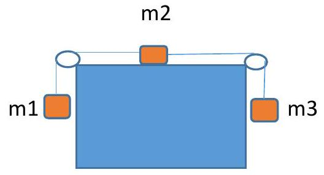

---
title: |
    UNIVERSITÀ DI CATANIA DIPARTIMENTO DI FISICA E ASTRONOMIA "ETTORE
    MAJORANA\"
---

A.A. 2022-2023 FISICA GENERALE I (A-Z) - PROVA IN ITINERE DEL 14/12/2022

COGNOME

NOME

MATR.

I\) Un corpo è lasciato cadere nel vuoto da una certa altezza rispetto
alla superficie terrestre. Se quando ha percorso solo un quarto della
sua caduta la sua velocità è v, qual è la sua velocità al momento
dell'impatto con la superficie terrestre? A) $v$ B) $2 v$ C)
$\sqrt{2} v$ D) $4 \mathrm{v}$ E) $1.5 \mathrm{v}$

2.  Un treno viaggia per 5 ore alla velocità costante di
    $100 \mathrm{~km} / \mathrm{h}$ e quindi percorre altri
    $750 \mathrm{~km}$ alla velocità costante di
    $150 \mathrm{~km} / \mathrm{h}$. Qual è la velocità media
    nell'intero percorso? A) $110 \mathrm{~km} / \mathrm{h}$ B)
    $130 \mathrm{~km} / \mathrm{h}$ C)
    $100 \mathrm{~km} / \mathrm{h}$ D)
    $125 \mathrm{~km} / \mathrm{h}$ E) non determinabile

3.  Due proiettili di masse diverse vengono sparati dalla stessa altezza
    orizzontalmente. La velocità iniziale, che ha quindi solo la
    componente orizzontale, è differente per i due proiettili.
    Trascurando ogni attrito, quale dei due proiettili impiega più tempo
    per arrivare a terra?

$\begin{array}{ll}\text { A) II proiettile con massa maggiore } & \text { B) Il proiettile sparato con velocità iniziale maggiore }\end{array}$

$\begin{array}{lll}\text { C) II proiettile sparato con velocità iniziale minore } & \text { D) Entrambi impiegano lo stesso tempo }\end{array}$

E\) Il proiettile con massa minore

4.  Due corpi identici cadono dalla stessa altezza $\mathrm{h}$ e
    raggiungono il suolo; il primo in caduta libera, il secondo
    scivolando lungo un piano inclinato. Risulta che il corpo che scende
    lungo il piano inclinato arriva al suolo con velocità inferiore.
    Perché?

$\begin{array}{ll}\text { A) perché compie una traiettoria più lunga } & \text { B) perché è soggetto a un'accelerazione inferiore }\end{array}$

$\begin{array}{ll}\text { C) perché la forza di gravità cui è soggetto è inferiore } & \text { D) perché sono presenti attriti }\end{array}$

E\) perché è soggetto ad una reazione normale al piano inclinato che si
oppone al moto e non presente nel caso di caduta libera.

5.  Dato il sistema in figura con
    $m_{1}=2.0 \mathrm{~kg}, \mathrm{~m}_{2}=3.0 \mathrm{~kg}, \mathrm{~m}_{3}=4.5 \mathrm{~kg}$,
    determinare l'accelerazione delle tre masse sapendo che il
    coefficiente d'attrito tra la massa $m_{2}$ e il piano orizzontale è
    0,2 e che i fili che collegano le tre masse sono inestensibili e di
    massa trascurabile.

 A)
$0,2 \mathrm{~g}$ B) il sistema rimane fermo C) $g$ D)
$1,04 \mathrm{~g}$ E) $0,5 \mathrm{~m} / \mathrm{s}^{2}$ 6) Due blocchi,
$m_{1}=10 \mathrm{~kg}$ e $m_{2}=5 \mathrm{~kg}$ sono appesi
verticalmente in serie, $m_{1}$ al soffitto mediante il filo 1 e $m_{2}$
a $m_{1}$ mediante il filo 2. Supponendo i due fili inestensibili e di
massa trascurabile, determinare le tensioni $T_{1}$ (filo 1) e $T_{2}$
(filo 2). (g = $9.8 \mathrm{~m} / \mathrm{s}^{2}$ ) A)
$T_{1}=147 \mathrm{~N} \quad T_{2}=147 \mathrm{~N}$ B)
$T_{1}=147 \mathrm{~N} \quad T_{2}=49 \mathrm{~N}$ C)
$T_{1}=49 \mathrm{~N} \quad T_{2}=49 \mathrm{~N}$ D) nessuna delle
precedenti risposte

7.  Uno scatolone avente la massa di $50 \mathrm{~kg}$ si trova
    inizialmente fermo su un pavimento orizzontale scabro; il
    coefficiente d'attrito statico tra scatolone e pavimento è pari a
    0.3. Se allo scatolone viene applicata una forza orizzontale pari a
    $100 \mathrm{~N}$, costante nel tempo, allora lo scatolone A) si
    muove con velocità costante B) rimane fermo C) si muove con
    accelerazione pari a $2 \mathrm{~m} / \mathrm{s}^{2}$ D)
    inizialmente si muove con velocità costante, poi accelera E)
    inizialmente si muove con accelerazione costante, poi rallenta e
    prosegue di moto uniforme

8.  Un corpo avente la massa di $0.15 \mathrm{~kg}$ si muove in linea
    retta su un piano orizzontale scabro; il coefficiente d'attrito
    dinamico tra corpo e piano vale 0.15. Se inizialmente il corpo
    possiede un'energia cinetica di $25 \mathrm{~J}$, quanta distanza,
    all'incirca, percorre prima di fermarsi?
    $\left(\mathrm{g}=9.8 \mathrm{~m} / \mathrm{s}^{2}\right)$ A)
    $25 \mathrm{~km}$ B) 0.11 metri C) $113.4 \mathrm{~m}$ D) 0.56 metri

E\) Non è possibile rispondere senza conoscere l'accelerazione del corpo

9.  Su un piano orizzontale privo di attrito due forze
    $\mathbf{F}_{1}=\left(-2 \mathbf{u}_{\mathbf{x}}+3 \mathbf{u}_{\mathbf{y}}\right) N$
    e
    $\mathbf{F}_{\mathbf{2}}=\left(-5 \mathbf{u}_{\mathbf{x}}-7 \mathbf{u}_{\mathbf{y}}\right) N$
    agiscono sullo stesso corpo. Determinare il lavoro totale per uno
    spostamento da $P_{1}(-7,11)$ a $P_{2}(3,-5)$, dove le coordinate
    sono espresse in $m$. A) $12 \mathrm{~J}$ B) - 6 J C)
    $-10 \mathrm{~J}$ D) $10 \mathrm{~J}$ E) nessuna di tali risposte è
    corretta

10. Una massa $m=102 \mathrm{~g}$, collegata ad una fune elastica
    $(\mathrm{k}=3.4 \mathrm{~N} / \mathrm{m})$, ruota su un piano
    orizzontale liscio con velocità costante
    $v=5 \mathrm{~m} / \mathrm{s}$, descrivendo una circonferenza di
    raggio $r=1.5 \mathrm{~m}$. Determinare l'energia meccanica totale
    del sistema massa-fune, sapendo che la lunghezza a riposo della fune
    è $\mathrm{I}_{0}=1 \mathrm{~m}$. A) $12.5 \mathrm{~J}$ B)
    $1.4 \mathrm{~J}$ C) $1250 \mathrm{~J}$ D) $1.7 \mathrm{~J}$ E)
    nessuna delle precedenti risposte

Punteggio:
==========

-   3 punti per ogni risposta esatta

-   $\quad$ - 1 punti per ogni risposta errata

-   0 punti in mancanza di risposta

La prova sarà considerata superata se saranno acquisiti un minimo di 12
punti (almeno 4 risposte corrette). Per avere accesso alla prova orale,
la media del punteggio di tutte le prove in itinere deve essere almeno
15.

??? success "Visualizza le soluzioni"
    

??? note "Visualizza lo svolgimento"
    

---

[:fontawesome-regular-file-pdf: Download](pdf/2023-01-13.pdf){ .md-button }
