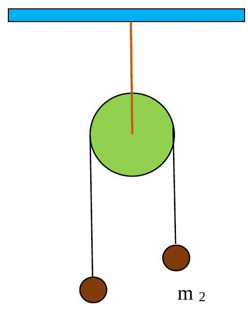

>DIPARTIMENTO DI FISICA E ASTRONOMIA "ETTORE MAJORANA" 
A.A. 2022-2023 - FISICA GENERALE I
PROVA IN ITINERE DEL XXXXXX

## Esercizio 1
Due corpi puntiformi $\mathrm{m}_{1}=100 \mathrm{~g}$ e $\mathrm{m}_{2}=700 \mathrm{~g}$ sono fissati agli estremi di un'asta rigida di lunghezza 1 $=48 \mathrm{~cm}$ e di massa trascurabile. La distanza del centro di massa del sistema da $\mathrm{m}_{1}$ è: 
    
A) $42 \mathrm{~cm}$ 

B) $24 \mathrm{~cm}$ 

C) $6 \mathrm{~cm}$ 

D) $12 \mathrm{~cm}$ 

E) nessuna delle precedenti risposte

??? success "Visualizza le soluzioni"
    :octicons-check-circle-fill-16:{ .green-check } Soluzione ufficiale
    
    Risposta corretta: A

??? note "Visualizza lo svolgimento"
    

## Esercizio 2
Due punti materiali di peso $\mathrm{p}_{1}=4.3 \mathrm{~N}$ e $\mathrm{p}_{2}=2.7 \mathrm{~N}$ si muovono di moto rettilineo uniforme con velocità, di verso opposto, $\mathrm{v}_{1}=4 \mathrm{~m} / \mathrm{s}$ e $\mathrm{v}_{2}=-7 \mathrm{~m} / \mathrm{s}$. Calcolare la velocità del centro di massa. 
    
A) $2.42 \mathrm{~m} / \mathrm{s}$ 

B) $-0.24 \mathrm{~m} / \mathrm{s}$ 

C) $6.25 \mathrm{~m} / \mathrm{s}$ 

D) zero 

E) nessuna delle precedenti risposte

??? success "Visualizza le soluzioni"
    :octicons-check-circle-fill-16:{ .green-check } Soluzione ufficiale
    
    Risposta corretta: B

??? note "Visualizza lo svolgimento"
    

## Esercizio 3
Un cannone, di massa $\mathrm{M}=2500 \mathrm{~kg}$ e inizialmente fermo, spara un proiettile di massa $\mathrm{m}=5 \mathrm{~kg}$ con velocità $\mathrm{v}=300 \mathrm{~m} / \mathrm{s}$. Calcolare l'energia cinetica del cannone subito dopo lo sparo. 
    
A) $112.5 \mathrm{MJ}$ 

B) $225000 \mathrm{~J}$ 

C) $450 \mathrm{~J}$ 

D) dati non sufficienti 

E) nessuna delle precedenti risposte

??? success "Visualizza le soluzioni"
    :octicons-check-circle-fill-16:{ .green-check } Soluzione ufficiale
    
    Risposta corretta: C

??? note "Visualizza lo svolgimento"
    

## Esercizio 4
Una palla da baseball di 150 g lanciata alla velocità di $41.6 \mathrm{~m} / \mathrm{s}$ viene respinta indietro al lanciatore con la velocità di $61.5 \mathrm{~m} / \mathrm{s}$. La mazza resta in contatto con la palla per $4.70 \mathrm{~ms}$. Qual è la forza media esercitata dalla mazza sulla palla? 
    
A) $5340 \mathrm{~N}$ 

B) $3290 \mathrm{~N}$ 

C) $787.5 \mathrm{~N}$ 

D) forza nulla 

E) nessuna delle precedenti risposte

??? success "Visualizza le soluzioni"
    :octicons-check-circle-fill-16:{ .green-check } Soluzione ufficiale
    
    Risposta corretta: B

??? note "Visualizza lo svolgimento"
    

## Esercizio 5
Un corpo rigido di massa $m=4 \mathrm{~kg}$, può ruotare attorno ad un asse passante per un suo punto.

Determinare il momento di inerzia I rispetto all'asse di rotazione,
sapendo che quello rispetto all'asse parallelo passante per il centro di
massa e distante $0.3 \mathrm{~m}$ dal primo è
$\mathrm{I}_{\mathrm{cm}}=0,12 \mathrm{~kg} \mathrm{~m}$. 

A) $0.36 \mathrm{~kg} \mathrm{~m}^{2}$ 

B) $0.12 \mathrm{~kg} \mathrm{~m}^{2}$ 

C) $0.48 \mathrm{~kg} \mathrm{~m}^{2}$ 

D) $15 \mathrm{~kg} \mathrm{~m}^{2}$

E) nessuna di queste risposte

??? success "Visualizza le soluzioni"
    :octicons-check-circle-fill-16:{ .green-check } Soluzione ufficiale
    
    Risposta corretta: C

??? note "Visualizza lo svolgimento"
    

## Esercizio 6
Una ruota (anello sottile $\mathrm{I}=\mathrm{mR}^{2}$ ) di massa $31.4 \mathrm{~kg}$ e raggio $1.21 \mathrm{~m}$ ruota alla velocità angolare di 283 giri/min attorno al suo asse. Trovare la potenza media richiesta per fermarla in $14.8 \mathrm{~s}$. 
    
A) $88 \mathrm{~W}$ 

B) $136 \mathrm{~W}$ 

C) $1360 \mathrm{~W}$ 

D) $12.5 \mathrm{~W}$ 

E) nessuna di queste possibilità 

??? success "Visualizza le soluzioni"
    :octicons-check-circle-fill-16:{ .green-check } Soluzione ufficiale
    
    Risposta corretta: C

??? note "Visualizza lo svolgimento"
    

## Esercizio 7

Due corpi puntiformi di massa uguale sono fissati agli estremi di un'asta rigida orizzontale di lunghezza $50 \mathrm{~cm}$ e di massa trascurabile, posta in rotazione con velocità angolare di $15 \mathrm{rad} / \mathrm{s}$ attorno ad un asse verticale passante per il centro di massa del sistema. Ad un certo istante, mediante un meccanismo interno, l'asta si allunga allontanando ciascuna massa di $5 \mathrm{~cm}$ dall'asse di rotazione. Calcolare la nuova velocità angolare. 

A) $10.4 \mathrm{rad} / \mathrm{s}$ 

B) $15 \mathrm{rad} / \mathrm{s}$ 
    
C) $18.5 \mathrm{rad} / \mathrm{sec}$ 
    
D) l'asta si ferma 
    
E) nessuna delle precedenti risposte

??? success "Visualizza le soluzioni"
    :octicons-check-circle-fill-16:{ .green-check } Soluzione ufficiale
    
    Risposta corretta: A

??? note "Visualizza lo svolgimento"
    

## Esercizio 8
Un cilindro $\left(\mathrm{I}_{\mathrm{c}}=1 / 2 \mathrm{~m} \mathrm{R}^{2}\right)$, inizialmente fermo, scende senza strisciare lungo un piano inclinato. La velocità del suo centro di massa alla base del piano inclinato è di $2 \mathrm{~m} / \mathrm{s}$. Determinare l'altezza h di partenza. 

A) dati non sufficienti 

B) $30.6 \mathrm{~cm}$ 

C) $20.4 \mathrm{~cm}$ 
    
D) $41.3 \mathrm{~cm}$ 
    
E) nessuna delle precedenti risposte

??? success "Visualizza le soluzioni"
    :octicons-check-circle-fill-16:{ .green-check } Soluzione ufficiale
    
    Risposta corretta: B

??? note "Visualizza lo svolgimento"
    

## Esercizio 9
Due corpi $\mathrm{m}_{1}=0.2 \mathrm{~kg}$ e $\mathrm{m}_{2}=0.3 \mathrm{~kg}$ si muovono lungo la stessa direzione e lo stesso verso con velocità $\mathrm{v}_{1}$ $=3 \mathrm{~m} / \mathrm{s}$ e $\mathrm{v}_{2}=2 \mathrm{~m} / \mathrm{s}$. Determinare la variazione di energia cinetica del sistema in seguito ad un urto completamente anelastico. 
    
A) $-0.06 \mathrm{~J}$ 

B) - $3.2 \mathrm{~J}$ 

C) $+3.2 \mathrm{~J}$ 

D) zero 

E) nessuna di tali risposte è corretta

??? success "Visualizza le soluzioni"
    :octicons-check-circle-fill-16:{ .green-check } Soluzione ufficiale
    
    Risposta corretta: A

??? note "Visualizza lo svolgimento"
    

## Esercizio 10
Due masse $m_{1}=200$ g e $m_{2}=400 \mathrm{~g}$ sono fissate agli estremi di una fune inestensibile e di massa trascurabile messa a cavallo di una puleggia di massa $\mathrm{M}$ e raggio $\mathrm{R}=10 \mathrm{~cm}$, libera di ruotare senza attrito attorno ad un asse passante per il suo centro. Sapendo che le masse sono soggette ad una accelerazione pari a $1 \mathrm{~m} / \mathrm{s}^{2}$, calcolare il momento d'inerzia della puleggia rispetto al suo asse. Si supponga che la fune non scivoli sulla puleggia. 
    
A) zero 

B) $0.2610^{-2} \mathrm{~kg} \mathrm{~m}^{2}$ 

C) $1.3610^{-2} \mathrm{~kg} \mathrm{~m}^{2}$ 

D) $2.610^{-2} \mathrm{~kg} \mathrm{~m}^{2}$ 

E) nessuna delle precedenti risposte

$\mathrm{m}_{1}$

??? success "Visualizza le soluzioni"
    :octicons-check-circle-fill-16:{ .green-check } Soluzione ufficiale
    
    Risposta corretta: C

??? note "Visualizza lo svolgimento"
    

---

[:fontawesome-regular-file-pdf: Download](../pdf/2023-01-30.pdf){ .md-button }
