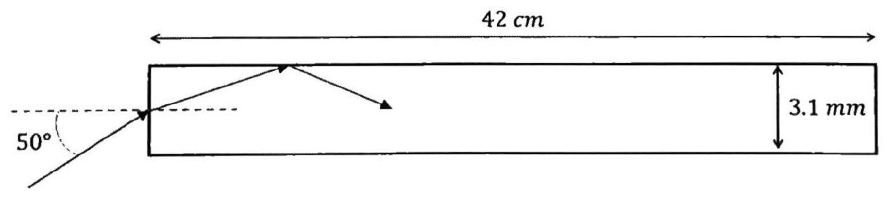

>UNIVERSITÀ DEGLI STUDI DI CATANIA - DIPARTIMENTO DI FISICA E ASTRONOMIA 
CORSO DI LAUREA IN FISICA  
ESAME SCRITTO DI FISICA GENERALE II  
12/07/2023 
(prova completa)

---

## Problema 1
Due cariche positive $q=10 n C$, uguali tra loro, sono tenute fisse ad una distanza tra loro pari a $d=1 \mathrm{~m}$. Una carica puntiforme $q_{0}=1 \mathrm{pC}$ viene posta sul piano normale alla congiungente delle due cariche $q$ e passante per il suo punto di mezzo.

Determinare il luogo geometrico dei punti appartenenti a tale piano per $\mathrm{i}$ quali la forza elettrostatica agente su $q_{0}$ ha la massima intensità, e calcolare modulo, direzione e verso della forza in tali punti. Giustificare eventuali approssimazioni.

??? success "Visualizza le soluzioni"
    

??? note "Visualizza lo svolgimento"
    

## Problema 2
Una batteria ha una forza elettromotrice $\varepsilon$ ed una resistenza interna $r$. Ai capi della batteria viene connesso un resistore variabile $R$. Si trovi il valore di $R$ tale da: (I) massimizzare la differenza di potenziale ai capi del resistore variabile; (II) massimizzare la corrente nel circuito; (III) massimizzare la potenza fornita alla resistenza.

??? success "Visualizza le soluzioni"
    

??? note "Visualizza lo svolgimento"
    

## Problema 3
Un filo è sagomato a forma di quadrato di lato $\ell=1 \mathrm{~m}$, ed è percorso da una corrente $I=1 \mathrm{~A}$. Determinare il modulo dell'induzione magnetica $\vec{B}$ nel punto $O$ al centro della spira.

??? success "Visualizza le soluzioni"
    

??? note "Visualizza lo svolgimento"
    

## Problema 4
Un fascio laser colpisce una faccia estrema di una lastra di materiale trasparente $(n=1.48)$, come mostrato in figura, nel punto centrale della faccia. L'angolo di incidenza e le dimensioni della lastra sono indicate in figura. Determinare il numero di riflessioni interne del fascio prima di ri-emergere dal lato opposto della lastra.

??? success "Visualizza le soluzioni"
    

??? note "Visualizza lo svolgimento"
    

---

[:material-image: Immagine del compito](images/2023-07-12-completa.jpg){ .md-button }
