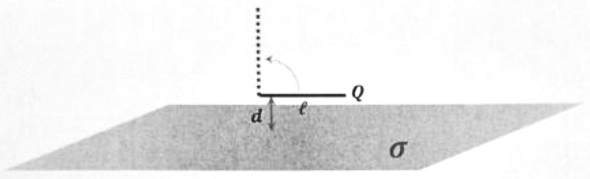

>UNIVERSITÀ DEGLI STUDI DI CATANIA - DIPARTIMENTO DI FISICA E ASTRONOMIA 
CORSO DI LAUREA IN FISICA 
ESAME SCRITTO DI FISICA GENERALE II 
06/09/2023 
(prova completa)

---

## Problema 1
Nello spazio è dato un sottile piano isolante, infinito ed
uniformemente carico con densità superficiale
$\sigma=1 \mu \mathrm{C} / \mathrm{m}^{2}$. Al di sopra di esso, a
distanza $d=6 \mathrm{~cm}$, si trova una sottilissima bacchetta
isolante, lunga $\ell=10 \mathrm{~cm}$, uniformemente carica con carica
totale $Q=3.5 \mu \mathrm{C}$. Determinare quanto vale il lavoro
compiuto dalle forze elettriche quando la bacchetta viene ruotata di
$90^{\circ}$ come schematizzato in figura.

??? success "Visualizza le soluzioni"
    

??? note "Visualizza lo svolgimento"
    

## Problema 2
In un tubo di vetro di sezione $S=1 \mathrm{~cm}^{2}$ si trova un
gas ideale alla pressione di $76 \mathrm{mmHg}$ e alla temperatura di
$20^{\circ} \mathrm{C}$. Una frazione pari al due per mille delle
molecole del gas viene ionizzata grazie a un intenso flusso di raggi
$X$. Valutare la velocità di deriva $v_{d}$ degli elettroni nel gas se
nel tubo passa una corrente di $10 \mathrm{~mA}$.

??? success "Visualizza le soluzioni"
    

??? note "Visualizza lo svolgimento"
    

## Problema 3
Due bobine piatte 1 e 2, costituite rispettivamente da 10 e 5 spire,
aventi raggio medio rispettivamente pari a $r_{1}=50 \mathrm{~cm}$ ed
$r_{2}=2 \mathrm{~cm}$, sono disposte in modo che i loro centri
coincidano e i loro piani formino un angolo uguale a $60^{\circ}$.
Calcolare il coefficiente di mutua induzione tra le due bobine. Se le
due bobine sono percorse rispettivamente da correnti pari a
$i_{1}=8 \mathrm{~A}$ ed $i_{2}=5 \mathrm{~A}$, calcolare il momento
della coppia esercitata dalla bobina 2 sulla bobina 1. Facoltativo: si
commentino possibili strade alternative adoperabili per il calcolo del
coefficiente di mutua induzione.

??? success "Visualizza le soluzioni"
    

??? note "Visualizza lo svolgimento"
    

## Problema 4
Nel sistema di riferimento $S$, due eventi $A$ e $B$ avvengono in
punti diversi $x_{A}$ ed $x_{B}$ dell'asse $\vec{x}$, e non sono
simultanei: in particolare $B$ segue $A$. È possibile trovare un sistema
di riferimento $S^{\prime}$ tale che in esso $B$ preceda $A$ ?

??? success "Visualizza le soluzioni"
    

??? note "Visualizza lo svolgimento"
    

---

[:material-image: Immagine del compito](images/2023-09-06-completa.jpg){ .md-button }
