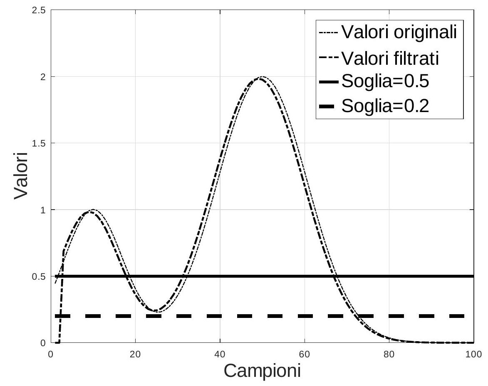

---
title: |
    Università degli studi di Catania Corso di Laurea in Fisica - Primo
    livello - A.A. 2021-2022 Esame di informatica - 7 gennaio 2022 Prof.
    Marco Russo
---

Occorre scrivere un programma in $\mathrm{C}$ che esegue un filtraggio
di una serie numerica $d$. Questo filtraggio deve essere calcolato
tramite una finestra mobile caratterizzata da $n_{w}$ valori. La serie
numerica $d$ si trova nel file dati.txt. Tale file contiene il numero di
campioni seguito dai campioni stessi. Nel file tutti i valori (compreso
il loro numero) sono rappresentati in notazione scientifica e si trovano
uno per ciascuna riga. I valori della finestra mobile sono ubicati nel
file f.txt la cui conformazione è la medesima del precedente.

All'acquisizione su array quasi-statico sia dei campioni che dei valori
del filtro occorre calcolare e stampare su video (in entrambi i casi) il
loro valore minimo e quello massimo.

Successivamente, occorre generare un nuovo array quasi-statico in cui
vengono immessi i valori filtrati $d f_{i}$. Considerato che la
dimensione $n_{w}$ della finestra è sempre dispari e fissato $n_{2}$ il
risultato della divisione intera di $n_{w}$ per 2 , avremo che i primi e
gli ultimi $n_{2}$ valori dell'array filtrato devono essere posti a 0 .
Per gli altri valori avremo che il valore $d f_{i}$ sarà determinato dal
prodotto scalare tra il vettore degli $n_{w}$ valori del filtro e il
vettore di medesima ampiezza di valori consecutivi di $d$ con valore
centrale pari proprio a $d_{i}$, cioè:

$$d f_{i}=\sum_{j=-n_{2}}^{n_{2}} w_{j+n_{2}} d_{i+j} .$$

In ultimo, il programma deve chiedere da tastiera una soglia. A fronte
di questa soglia, si devono individuare gli intervalli laddove i dati
filtrati $d f_{i}$ sono maggiori della soglia. Tra tutti questi
intervalli occorre fornire in output quello più ampio ed i numeri dei
campioni di inizio e fine di quest'intervallo. I campioni si intendono
numerati a partire dal valore uno. Come di consueto è vietato l'uso di
array statici.

La figura mostra i dati forniti dal docente come esempio.

Quindi se il file f.txt contiene:

$5.00000000+00$

$1.00000000 e-01$

$1.00000000 e-01$

$1.00000000 \mathrm{e}-0$

$2.00000000 e-01$

$5.00000000 \mathrm{e}-01$

Se diamo come soglia 0.5 avremo come output:

D\_min $=0.00 \quad D \_\max =2.00$

W\_min $=0.10$ W\_max $=0.50$

Soglia: 0.5

L\_max $=35$ Start $=32 \quad$ End $=66$

Se invece diamo come soglia 0.2 avremo come output:

D\_min $=0.00 \quad D \_\max =2.00$

W\_min $=0.10$ W\_max $=0.50$

Soglia: 0.2

$L_{-} \max =70$ Start=3 End=72

Laddove i valori del filtro sono:

Valutazione del compito.

  4 punti   Per l'acquisizione dei valori $d_{i}$
  --------- --------------------------------------------------------------------------
  4 punti   Per l'acquisizione dei valori del filtro $w_{i}$
  5 punti   Per il calcolo del minimo e del massimo $d_{i}$
  5 punti   Per il calcolo del minimo e del massimo $w_{i}$
  2 punti   Per l'acquisizione da tastiera della soglia
  7 punti   Per la creazione ed il calcolo di $d f$
  8 punti   Per la ricerca e stampa su video dei dati interenti l'intervallo cercato

??? success Visualizza le soluzioni
    

??? note Visualizza lo svolgimento
    

---

[:fontawesome-regular-file-pdf: Download](pdf/2022-01-07.pdf){ .md-button }
