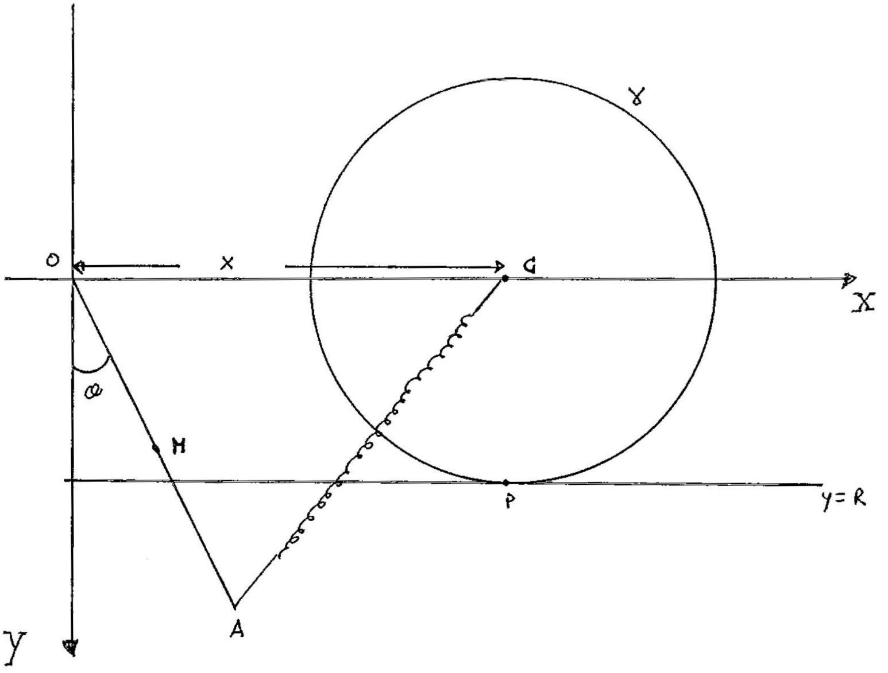

> Università degli studi di Catania Corso di laurea in ingegneria civile ed ambientale   Meccanica Razionale (Compito 2)  Appello del 24.06.2013

---

Dato un sistema materiale $S$ mobile in un piano verticale $\Pi$ nel
quale, introdotto un sistema di riferimento cartesiano ortogonale
$\{O, X, Y\}$ con l'asse delle $Y$ verticale discendente, si trova una
guida rettilinea $\mathrm{r}$ di equazione $y \Rightarrow R$, essendo
$R$ una fissata lunghezza. Il sistema $S$ é costituito da un disco
omogeneo $\gamma$ di centro $C$, raggio $R$ e massa $M$ e da un'asta
omogenea di massa $M$ e lunghezza $2 L$, il cui estremo é incernierato
in $O$ e il cui secondo estremo indicheremo con A. Tutti i precedenti
vincoli sono realizzati senza attrito, inoltre il disco $\gamma$ é
vincolato a rotolare senza strisciare sulla guida $r$, in modo che il
suo centro ha ordinata,' nel riferimento introdotto, costantemente
nulla.

Sul sistema oltre alle forse peso, agiscono le due forze

$$\{\dot{F}=-k(A-C), A\} \quad \text { e } \quad\{F=-k(C-A), C\}$$

essendo $k$ una opportuna costante positiva. Posto per semplicitá
$m g=4 \alpha k L$ essendo $\alpha$ un numero reale positivo con
$\alpha \neq 1$, si chiede di determinare:

1.  Le configurazioni di equilibrio del sistema $S$, indagando la
    stabilitá delle suddette configurazioni al variare di $\alpha$.

2.  Le-equazioni di moto e gli eventuali integrali primi.

3.  Studiare i moti linearizzati attorno alla configurazione di
    equilibrio di $S$ in cui il punto $A$ occupa la configurazione piú
    bassa consentita dai vincoli.

??? note "Visualizza lo svolgimento"
    

---

[:fontawesome-regular-file-pdf: Download](pdf/2014-2016-t.pdf){ .md-button }