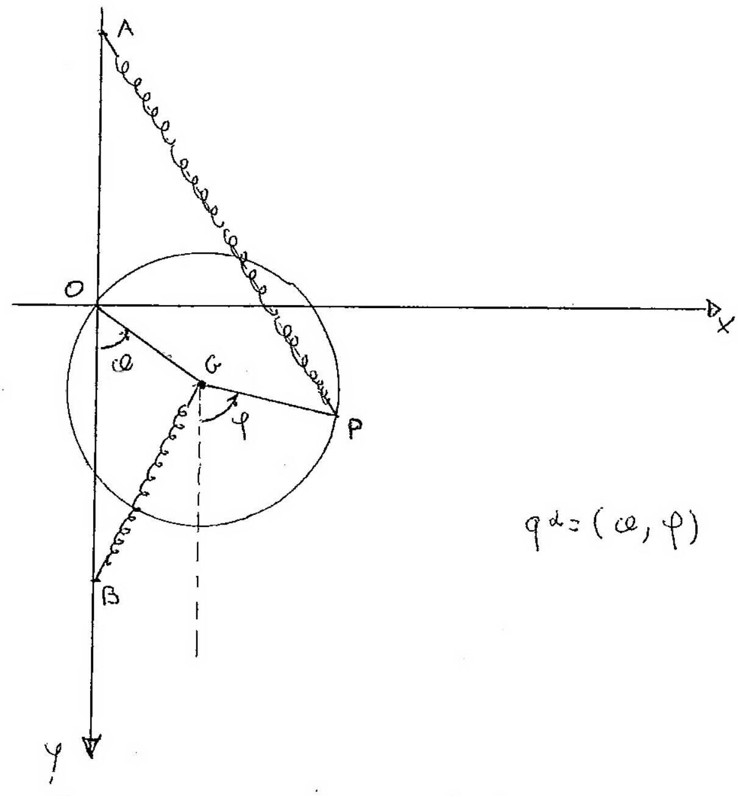

>Università degli studi di Catania Corso di laurea in Fisica  Meccanica Analitica  Appello del 20.11.2013

---

Sia dato un sistema materiale $S$ mobile, costituito da una
circonferenza omogenea $\gamma$ di massa $m$ e raggio $r$, vincolata a
muoversi su un piano verticale $\Pi$, mantenendo fisso un suo punto $O$,
e da un punto materiale $P$ di uguale massa vincolato a muoversi su
$\gamma$. Supposto che oltre alla forza peso sul sistema agiscano le
forze elastiche

$$\left\{F_{1}=-\frac{m g}{2 R}(P-A), P\right\} \quad\left\{F_{2}=-\frac{m g}{2 R}(G-B), G\right\}$$

essendo $G$ ill centro di $\gamma$, con $A$ e $B$ due punti nella
verticale per $O$ rispettivamente al di sopra ed al di sotto di $O$ e a
distanza $2 R$ da esso. Supponendo che i vincoli siano lisci

!

Si chiede di:

1.  Determinare le configurazioni di equilibrio del sistema
    ${ }^{\prime} \mathrm{S}$, indagando la stabilitá delle suddette
    configurazioni.

2.  Determinare le equazioni di moto e gli eventuali integrali primi.

3.  Studiare i moti in prima approssimazione attorno alla evidente
    configurazione di equilibrio in cui $G$ occupa la posizione piú
    bassa consentita dai vincoli e $P$ coincida con $B$.

??? note "Visualizza lo svolgimento"
    
    Non ancora disponibile. Se sei in possesso dello svolgimento, valuta la possibilità di contribuire al progetto facendo click sull'icona di modifica in alto a destra

---

[:fontawesome-regular-file-pdf: Download](pdf/2014-2016-t.pdf){ .md-button }