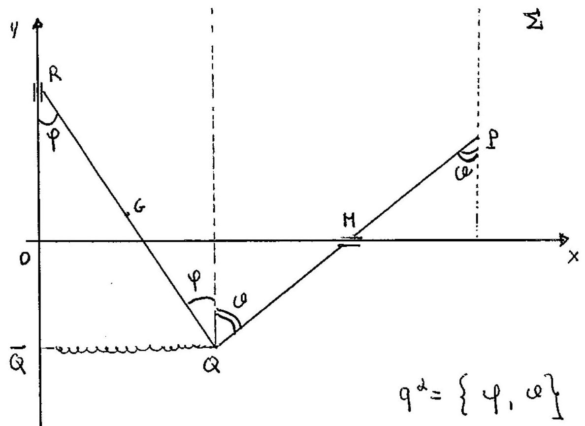

> Università degli studi di Catania  Corso di laurea in Fisica  Meccanica Analitica  Appello del 03.03.2014

---

Un sistema materiale, mobile in un piano verticale $\Sigma$, é
costituito da due aste omogenee $\mathrm{PQ}$ e $\mathrm{QR}$, aventi la
stessa massa $m$ e la stessa lunghezza $2 L$, incerniate nel punto $Q$.
Introdotto un sistema di riferimento cartesiano ortogonale levogiro
$\{o, x, y, z\}$, avente il piano $z=0$ sovrapposto al piano $\Sigma$ e
l'asse delle $y$ verticale ascendente, si assuma che il punto medio $M$
di $P Q$ sia vincolato a muoversi sull'asse delle $x$, mentre l'estremo
$R$ di $Q R$ sia vincolato a muoversi sull'asse delle $y$ e che tutti i
vincoli siano realizzati senza attrito. Supposto che sul sistema, oltre
alle forze peso, agisca la forza elastica

$$\{F=-k(Q-\bar{Q}), Q\}$$

essendo $k=\frac{m g}{4 L \alpha}$ con $\alpha>1, g$ il modulo della
accelerazione di gravitá, e $\bar{Q}$ la proiezione ortogonale di $Q$
sull'asse delle $y$. Si chiede di:

1.  Determinare le configurazioni di equilibrio del sistema, indagando
    la stabilitá delle suddette configurazioni.

2.  Determinare le equazioni di moto e gli eventuali integrali primi.

3.  Studiare i moti linearizzati attorno alla configurazione di
    equilibrio nella quale le due aste siano verticali e $Q$ il punto
    piú basso del sistema

??? note "Visualizza lo svolgimento"
    

---

[:fontawesome-regular-file-pdf: Download](pdf/2014-2016-t.pdf){ .md-button }