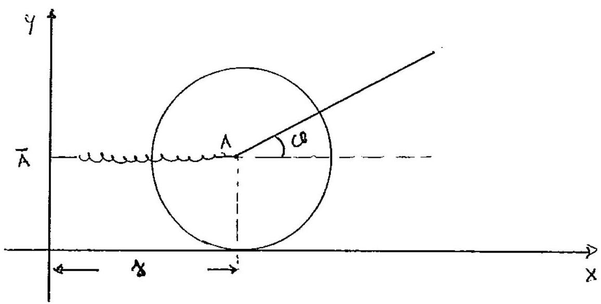

>Università degli studi di Catania  Corso di lauréa in Fisica  Meccanica Analitica  Appello del 19.05.2014

---

Un sistema materiale, mobile in un piano verticale $\Sigma$, é
costituito da un'asta omogenea di massa $m$ e lunghezza $L$, avente un
suo estremo $A$ incerniato nel centro di un disco omogeneo di massa $M$
e raggio $R$, il quale é vincolato a rotolare senza strisciare su una
guida orizzontale. Oltre alla forza peso agente sul sistema, sul punto
$A$ agisce una forza elastica $F=-k(A-\bar{A})$ dove $\bar{A}$ é la
proiezione ortogonale di $A$ su una retta fissa verticale.

Si chiede di:

1.  Determinare le configurazioni di equilibrio del sistema, indagando
    la stabilitá delle suddette configurazioni.

2.  Determinare le equazioni di moto e gli eventuali integrali primi.

3.  Studiare i moti linearizzati attorno alle configurazioni di
    equilibrio del sistema.

4.  Nell'ipotesi in cui $k=0$ pronunziarsi sull'esistenza di altri
    integrali primi.

$$q \alpha \equiv\{\Delta, c\}$$

??? note "Visualizza lo svolgimento"
    

---

[:fontawesome-regular-file-pdf: Download](pdf/2014-2016-t.pdf){ .md-button }