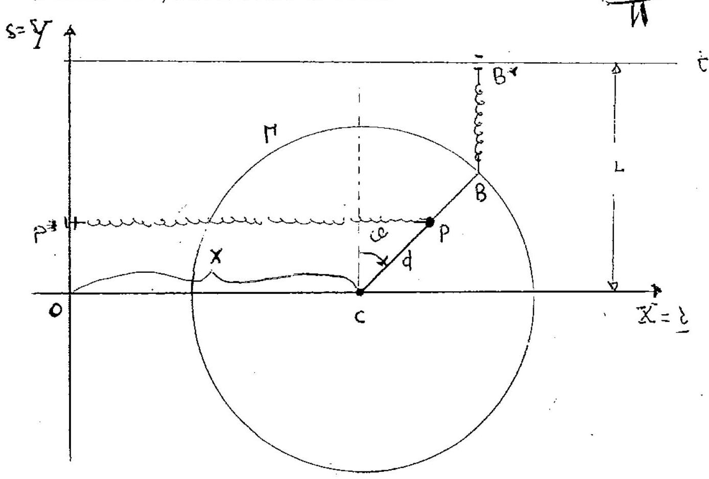

>Università degli studi di Catania  Corso di laurea in Fisica  Meccanica Analitica  Appello del 18.07.2014

---

Un sistema materiale, mobile su un piano verticale $\Pi$, é costituito
da un disco omogeneo $\Gamma$ di centro $C$, raggio $R$ e massa $M=2 m$
e da un bullone (da considerarsi puntiforme) di massa $m$, saldato in un
punto $P$ di $\Gamma$ (si indichi con $d$ la distanza $\overline{P C}$,
con $0 \leq d \leq R)$. Il centro $C$ di $\Gamma$ é vincolato a scorrere
senza attrito su una retta orizzontale $r$ di $\pi$.

Sul sistema, oltre alle forze peso, agiscono le due forže '

$\left\{F_{1}=-k\left(P-P^{*}\right), P\right\} \quad\left\{F_{2}=-h\left(B \quad B^{*}\right), B\right\} \quad$
con $k>0, \quad h \geq 0$, essendo $P^{*}$ la proiezione ortogonale di
$P$ su uha retta verticale $s$ di $\Pi, B$ l'intersezione del raggio di
$\Gamma$ contenente $P$ con il bordo di $\Gamma$ (un punto fissato del
bordo di $\Gamma$ nel caso $d=0$ ), $B^{*}$ la proiezione ortogonale di
$B$ su una guida orizzontale $t$ di $\Pi$, posta superiormente ad $r$ e
distante $L$ da essa. Supponendo che i vincoli siano lisci, si chiede di

1.  determinare $h$ in modo che esistano configurazioni dai equilibrio
    nelle quali $B$ sta sulla retta $r$.

Nella ipotesi di cui al punto 1 , si chiede poi di:

2.  determinare le configurazioni di equilibrio del sistema,
    distinguendo i casi $d>0$ e $d=0$, studiando in particolare la
    stabilitá nel caso $d>0$;

3.  determinare le equazioni di moto e gli eventuali integrali primi
    (distinguendo i casi $d>0$ e $d=0$ );

4.  nel caso $d>0$, studiare i moti linearizzati attorno ad una
    configurazione di equilibrio in cui $P$ sta su $r$;

5.  nel caso $d=0$, studiare il moto del sistema.

$$q^{\alpha}=(x, \theta)$$

??? note "Visualizza lo svolgimento"
    

---

[:fontawesome-regular-file-pdf: Download](pdf/2014-2016-t.pdf){ .md-button }