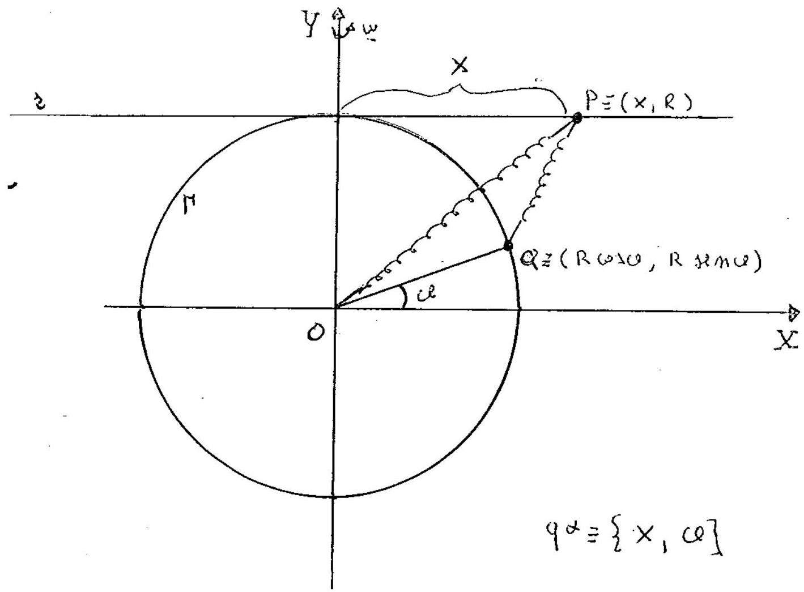

>Università degli studi di Catania  Corso di laurea in Fisica  Meccanica Analitica  Appello del 12.09.2014  

---

Un sistema materiale, costituito da due punti $P$ e
$Q$ di uguale massa $m$, é mobile su un piano verticale $\Pi$. Il punto
$Q$ é vincolato a muoversi su una circonferenza $\Gamma$ di $\Pi$ di
centro $O$ e raggio $R$, mentre $P$ é vincolato a muoversi sulla retta
orizzontale $r$, tangente superiormente a $\Gamma$.

Inoltre $\Pi$ é in rotazione uniforme con velocitá angolare
$\underline{\omega}$ attorno alla verticale, appartenente a $\Pi$,
passante per il centro $O$ di $\Gamma$.

Supposto che tutti i vincoli siano realizzati senza attrito e che sui
punti $P$ e $Q$, oltre alle forze peso, agiscano le forze

$$\left\{-\frac{m g}{R}(P-O), P\right\}, \quad\left\{-\frac{m g}{R}(P-Q), P\right\}, \quad\left\{-\frac{m g}{R}(Q-P), Q\right\},$$

essendo $g$ l'accelerazione di gravitá, e, posto $\psi^{2} \alpha g / R$
con $\alpha \geq 0$ ed $\alpha \neq 1+\sqrt{2}$, si chiede di:

1.  determinare le configurazioni di equilibrio relativo a $I 1$
    studiandone la stabilitá al variare di $\alpha$;

2.  determinare le equazioni del moto relativo e gli eventuali integrali
    primi;

3.  studiare i moti linearizzati attorno ad una configurazione di
    equilibrio, che é stabile per opportuni valori di $\alpha$, e
    confrontare la stabilitá lineare di tale configurazione con quella
    non lineare, al variare del parametro $\alpha$. \\end{abstract}

??? note "Visualizza lo svolgimento"
    
    Non ancora disponibile. Se sei in possesso dello svolgimento, valuta la possibilità di contribuire al progetto facendo click sull'icona di modifica in alto a destra

---

[:fontawesome-regular-file-pdf: Download](pdf/2014-2016-t.pdf){ .md-button }