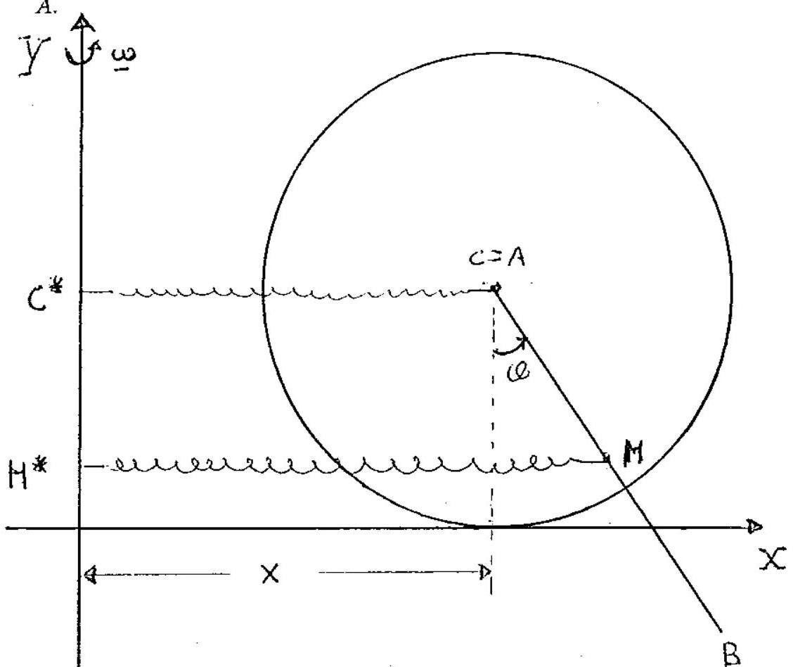

>Università degli studi di Catania  Corso di laurea in Fisica  Meccanica Analitica  Appello del 03.10 .2014

---

Un sistema materiale piano $S$, mobile su un piano verticale $\Pi$, é
costituito da un disco omogeneo $\Gamma$ di centro $C$, raggio $R$ e
massa $m$ e da un'asta omogenea $A B$ di lunghezza $4 L$ e massa $m$,
con l'estremo $A$ inernierato al centro del disco. Tutti i precedenti
vincoli sono realizzati senza attrito; inoltre il disco $\Gamma$ é
vincolato a rotolare senza strisciare su una guida orizzontale $r$ di
$\ddot{\text { rimanendo }}$ superiormente ad essa. Sul sistema $S$,
oltre alle forze peso agiscono le forze

$$\left\{-\frac{m g}{L}\left(C-C^{*}\right), C\right\}, \quad\left\{-\frac{m g}{L}\left(M-M^{*}\right), M\right\}$$

essendo $M$ il punto medio di $A B, C^{*}$ ed $M^{*}$ le proiezioni
ortogonali di $C$ ed $M$ su una retta verticale $s$ di $\Pi$, e $g$ il
modulo dell'accelerazione di gravitá.

Supposto che il piano $\Pi$ sia posto in rotazione uniforme attorno alla
verticale $s$ con velocitá angolare $\omega=\sqrt{\alpha g / L}$ con
$0 \leq \alpha \leq 1$ si chiede, relativamente a $\Pi$, di:

1.  determinare le configurazioni di equilibrio del sistema al variare
    di $\alpha$, studiandone la stabilitá per $0 \leq \alpha<1$

2.  determinare le equazioni di moto e gli eventuali integrali primi
    (distinguendo il caso $\alpha<1$ dal caso $\alpha=1$ )

3.  studiare i moti linearizzati attorno alla evidente configurazione di
    equilibrio in cui l'asta $A B$ é sovrapposta alla retta $s$ con $B$
    al di sotto di A.

$B$

$$q^{\alpha} \geq\{x, e\}$$

??? note "Visualizza lo svolgimento"
    

---

[:fontawesome-regular-file-pdf: Download](pdf/2014-2016-t.pdf){ .md-button }