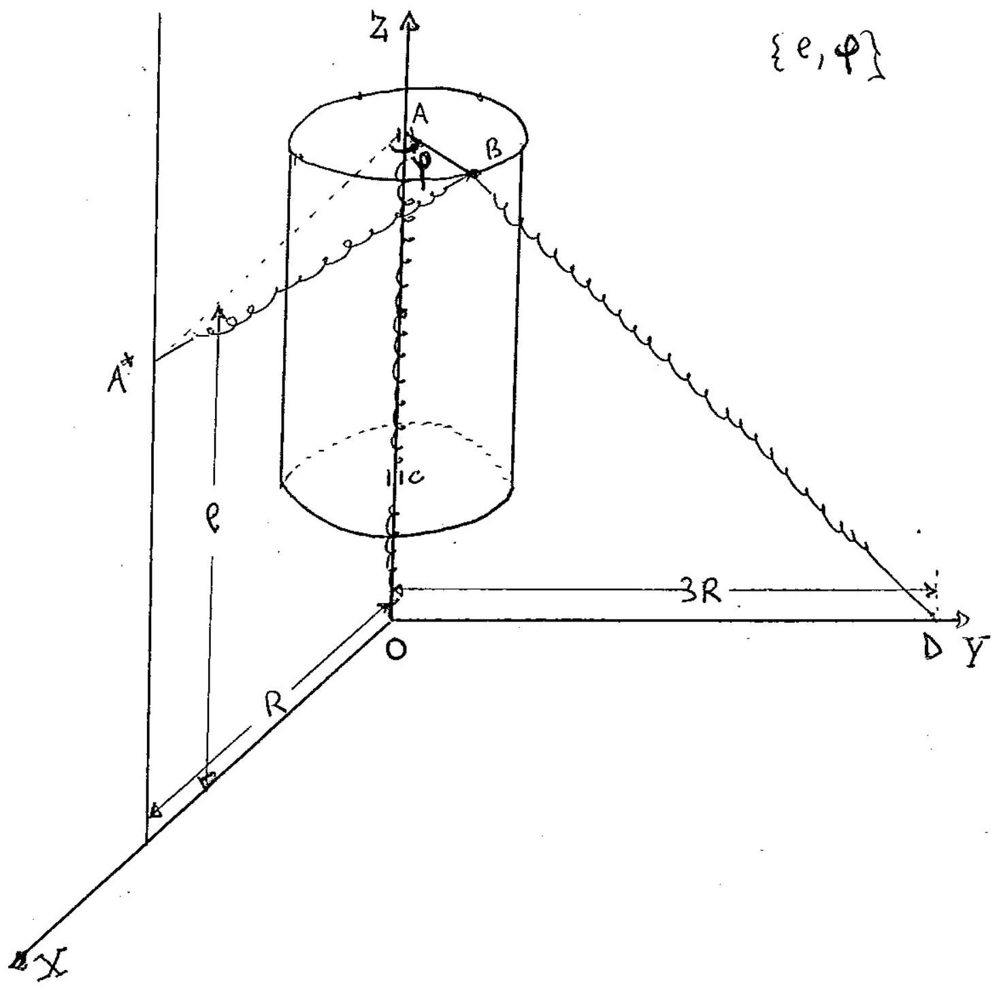

>Università degli studi di Catania  Corso di laurea in Matematica  Compito di Fisica Matematica  Appello del 11.12.2015

---

Sia dato un sistema materiale $S$, costituito da un cilindro omogeneo di
raggio $R / 2$ altezza $h$ e massa $m$. L'asse del cilindro é vincolato
a scorrere senza attrito, lungo l'asse $Z$ di un sistema di riferimento
ortonormale $\{O, X, Y, Z\}$, tramite due cerniere cilindriche poste nei
punti $A$ e $C$ rispettivamente in corrispondenza dei centri delle basi
superiore ed inferiore del cilindro. Supposto che oltre alla forza peso
sul sistema agiscano le forze elastiche

$\left\{F_{1}=-2 \gamma(A-O), A\right\},\left\{F_{2}=-\sqrt{3} \gamma\left(B-A^{*}\right), B\right\},\left\{F_{3}=-\gamma(B-D), B\right\}$,

dove $\gamma$ é una costante positiva, $B$ é un punto posto sul bordo
della base superiore del cilindro, $A^{*}$ é la proiezione ortogonale di
$A$ su una retta verticale passante per l'asse $X$ e distante $R$ da
$Z, D$ é un punto sull'asse $Y>0$ a distanza $3 R$ dall'origine $O$.
Dati le coordinate Lagrangiani $l=O A$ e $\varphi=A^{*} \widehat{A} B$

1.  Determinare le configurazioni di equilibrio del sistema $S$,
    studiando lạ stabilitá delle suddette configurazioni.

2.  Determinare le equazioni di moto e gli eventuali integrali primi.

3.  Studiare i moti linearizzati attorno alle configurazioni di
    equilibrio.

??? note "Visualizza lo svolgimento"
    

---

[:fontawesome-regular-file-pdf: Download](pdf/2014-2016-t.pdf){ .md-button }