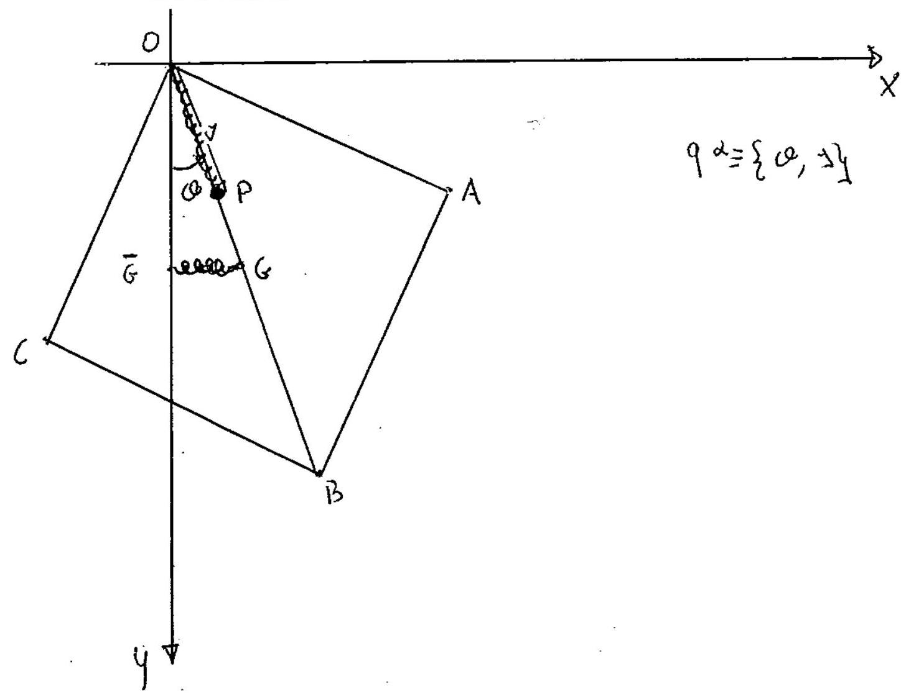

>Università degli studi di Catania  Corso di laurea in Matematica  Compito di Fisica Matematica  Appello del 11.02.2016

---

Sia dato un sistema materiale $S$, posto in un piano verticale $\Pi$,
costituito dà una lamina quadrata $O A B C$, omogenea e pesante, di
massa $m$ diagonale $2 L$ e baricentro $G$, e da un punto materiale $P$
avente anch'esso massa $m$, vincolato a scorrere senza attrito lungo la
diagonale $O B$ della lamina. La lamina quadrata. puó ruotare attorno al
suo vertice $O$ fisso nel piano verticale II. Oltre alle forze peso
agiscono, sul punto materiale $P$ e sul baricentro $G$ della lamina
quadrata, le seguenti forze elastiche

$$\left\{F_{1}=-k(s-L) \frac{(P-O)}{|P-O|}, P\right\}, \quad\left\{F_{2}=-k(G-\bar{G}), G\right\},$$

essendo s la distanza del punto $P$ dal vertice $O$ lungo la diagonale
$O B$ della lamina, la costante elastica $k=\frac{2 m g}{L}$, e
$\vec{G}$ la proiezione del baricentro $G$ della lamina, sulla verticale
passante per $O$. Supposti i vincoli lisci, e scegliendo come
$\{\vartheta, s\}$ le coordinate lagrangiane (si veda la figura), si
chiede di determinare:

1.  Le configurazioni di equilibrio del sistema $S$, indagando la
    stabilitá delle suddette configurazioni.

2.  Le equazioni di moto e gli eventuali integrali primi.

3.  I moti, in prima approssimazione, attorno alla configurazione di
    equilibrio in cui il sistema occupa la posizione corrispondente al
    piú piccolo valore di $\vartheta$ consentito.

??? note "Visualizza lo svolgimento"
    

---

[:fontawesome-regular-file-pdf: Download](pdf/2014-2016-t.pdf){ .md-button }