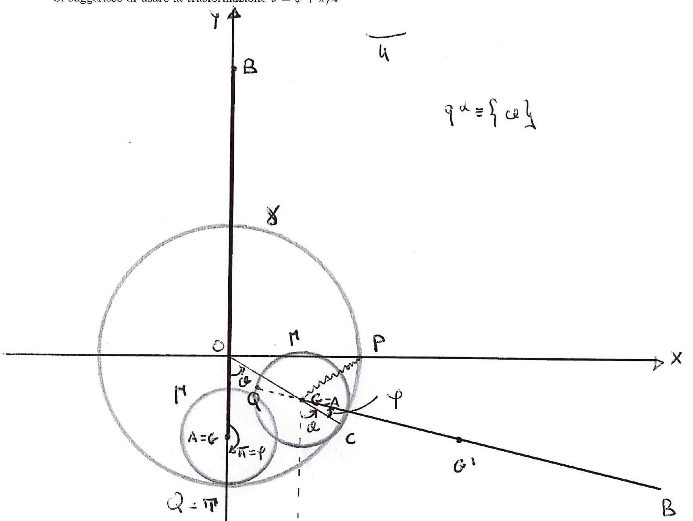

>Università degli studi di Catania  Corso di laurea triennale in Fisica  Esame di Meccanica Analitica  Appello del 28.02.2020

---

Un sistema materiale rigido, posto in un piano verticale II, é
costituito da una sbarra omogenea pesante $A B$ di massa $m$ e lunghezza
$L$ e da un disco omogeneo pesante $\Gamma$ di massa $2 m$, centro $G$ e
raggio $r$. L'asta $A B$ é rigidamente saldata sul disco $\Gamma$, lungo
un suo raggio, in maniera tale che l'estremo $A$ coincida. con il centro
del disco. Il disco $\Gamma$ é vincolato a rotolare senza strisciare,
lungo il bordo interno di una guida circolare $\gamma$ di raggio $R=3 r$
fissa nel piano verticale, in maniera tale che quando $\Gamma$ si trova
nella posizione piú bassa (vedi figura) il vettore $B-A$ sia verticale
ascendente. Sul sistema oltre alla forza peso agisce la forza elastica

$$\{F=-k(G-P), G\} \quad \text { con } k>0$$

essendo $P$ il punto fisso di intersezione della guida circolare
$\gamma$ con l'asse delle $x$ positive, come in figura. Supponendo che
valgano le relazioni $k=m g / r$ e $L=(12 / \sqrt{2}) r$ e scegliendo
come coordinata lagrangiana l'angolo $\theta$ che la direzione di
$\overrightarrow{O G}$ forma con la verticale discendente (vedi figura),
si chiede di determinare

1.  Le configurazioni di equilibrio ${ }^{1}$ del sistema, studiandone
    la stabilitá.

2.  Scrivere l'equazione di moto, determinando gli eventuali integrali
    primi.

3.  Studiare i moti in prima approssimazione attorno ad una
    configurazione di equilibrio stabile per il sistema.

${ }^{1}$ Si suggerisce di usare la trasformazione
$\vartheta=\psi^{i}+\pi / 4$

---

??? note "Visualizza lo svolgimento"
    

---

[:fontawesome-regular-file-pdf: Download](pdf/2020-02-28.pdf){ .md-button }