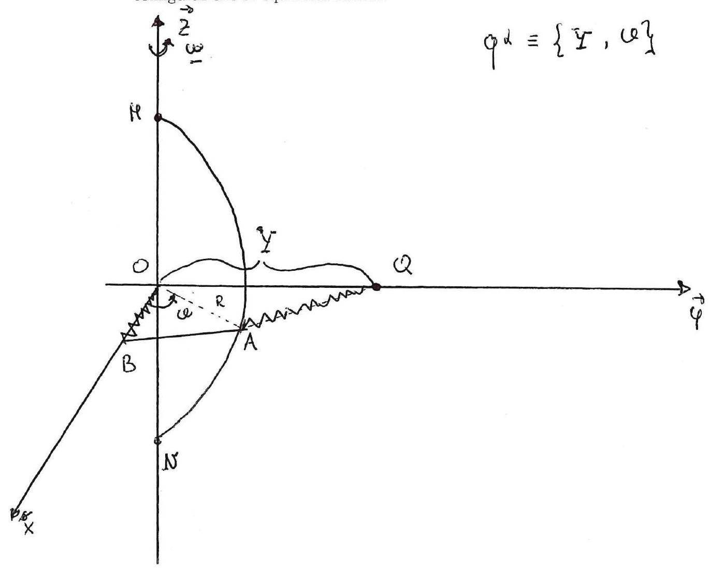

>Università degli studi di Catania  Corso di laurea triennale in Fisica  Esame di Meccanica Analitica  Appello del 10.09.2021

---

Sia dato un sistema materiale costituito da un semidisco omogeneo $S$ avente diametro di base $M N$ massa $m$ e raggio $R$, da un'asta omogenea $A B$ di massa $m$ e lunghezza $R$, da un punto materiale $Q$ di massa $m$. Il sistema é soggetto ai seguenti vincoli (vedi figura): 1) il diametro $M N$ di $S$ é saldato a due cerniere cilindriche fissate su una retta verticale $z ; 2$ ) l'estremo $B$ dell'asta é libero di muoversi su una retta orizontale $x$ incidente $z$ nel punto medio $O$ di $M N$, mentre l'estremo $A$ é fissato nel punto di $S$ che ha distanza $R$ da $M N$.3) il punto $Q$ é libero di muoversi su una retta orizontale $y$, ortogonale ad $x$, ed incidente $z$ sempre nel punto $O$. Scegliamo quindi come sistema di riferimento un sistema ortonormale levogiro $\{O, \vec{x}, \vec{y}, \vec{z}\}$ tale che $\vec{z}$ sia orientato verso l'alto (vedi figura) e supponiamo che tale riferimento sia in rotazione uniforme con velovitá angolare $\omega$ attorno a $\vec{z}$, utilizzando come coordinate lagrangiane l'angolo $\vartheta$ che $O A$ forma con l'asse $\vec{x}$ positivo e la distanza $Y$ del punto $Q$ dall'origine $O$. Supponendo inoltre che tutti i vincoli siano realizzati senza attrito e che sul sistema agiscano le forzc elastiche

$$\{F=-k(B-O), B\} \quad\left\{F_{1}=-2 k(Q-A), Q\right\} \quad\left\{F_{2}=-2 k(A-Q), A\right\}$$

con $k>0$. Si chiede di determinare nel riferimento relativo
$\{O, \vec{x}, \vec{y}, \vec{z}\}$ :

1.  dimostrando che le sollecitazioni dovute alle forze di Coriolis,
    agenti sul sistema, sono sempre nulle ma calcolando in ogni caso il
    potenziale generalizzato associato al sistema

2.  determinando le diverse configurazioni di equilibrio, e discutendo
    della loro stabilitá. nel caso in cui $m \omega^{2}-2 k \neq 0$.

3.  Scrivendo le equazioni di moto, e gli eventuali integrali primi.

4.  Studiando i moti in prima approssimazione attorno ad una eventuale
    configurazione di equilibrio stabile.

---

??? note "Visualizza lo svolgimento"
    

---

[:fontawesome-regular-file-pdf: Download](pdf/2021-09-10.pdf){ .md-button }