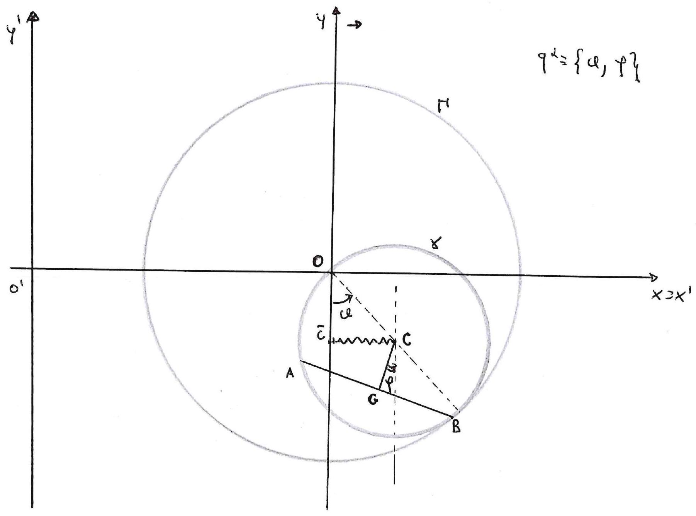

>Università degli studi di Catania  Corso di laurea triennale in Fisica  Esame di Meccanica Analitica  Appello del 24.09.2021

---

In un piano verticale, si consideri un riferimento fisso
$\left\{O^{\prime}, x^{\prime}, y^{\prime}\right\}$ ed un riferimento
mobile relativo $\{O, x, y\}$, con gli assi orizzontali $x$ ed
$x^{\prime}$ costantemente sovrapposti, che si muove di moto traslatorio
lungo la direzione positiva di $x^{\prime}$ con accelerazione costante
$a=g$ (essendo $g$ l'accelerazione di gravitá).

Solidale con il riferimento mobile relativo, sia dato un sistema
materiale $S$, posto nel piano verticale $x y$, costituito da un disco
omogenco $\gamma$ di massa $M$ centro $C$ e raggio $R$ e da un'asta
omogenea $A B$ di massa $2 M$ baricentro $G$ e lunghezza $L=\sqrt{3} R$.
Il sistema é soggetto ai seguenti vincoli: $\gamma$ é vincolata a
rotolare senza strisciare all'interno di una circonferenza fissa.
$\Gamma$ di centro $O$ e raggio $2 R$; l'asta $A B$ ha gli estremi $A$ e
$B$ vincolati a scorrere senza attrito sul bordo di $\gamma$ (vedi
figura).

Sul sistema $S$, altre alla forza peso, agisce la forza
$\{F=-k(C-\bar{C}), C\}$, dove $\bar{C}$ é la proiezione ortogonale di
$C$ sull'asse delle $y$ e $k$ é una costante positiva. Sciegliando come
coordinate lagrangiane le variabili $\{\vartheta, \varphi\}$ dove
$\vartheta$ é l'angolo che il vettore $C-O$ forma con la verticale
discendente e $\varphi$ é l'angolo che il vettore $G-C$ forma con la
verticale discendente (passante per $C$ ) e ponendo per semplicitá
$k=6 \sqrt{2} \mathrm{Mg} / R, \quad$ si chiede di :

1.  Determinare tutte le possibili configurazioni di equilibrio relativo
    ${ }^{1}$ di $S$, analizzando la loro stabilitá ed instabilitá.

2.  Scrivere le equazioni del moto relativo di $S$ e gli eventuali
    integrali primi

3.  Studiare i moti in prima approssimazione attorno ad una eventuale
    configurazione di equilibrio stabile per il sistema.

${ }^{1} \mathrm{Si}$ suggerisce di usare la trasformazione
$\vartheta=\psi+\pi / 4$.

---

??? note "Visualizza lo svolgimento"
    

---

[:fontawesome-regular-file-pdf: Download](pdf/2021-09-24.pdf){ .md-button }